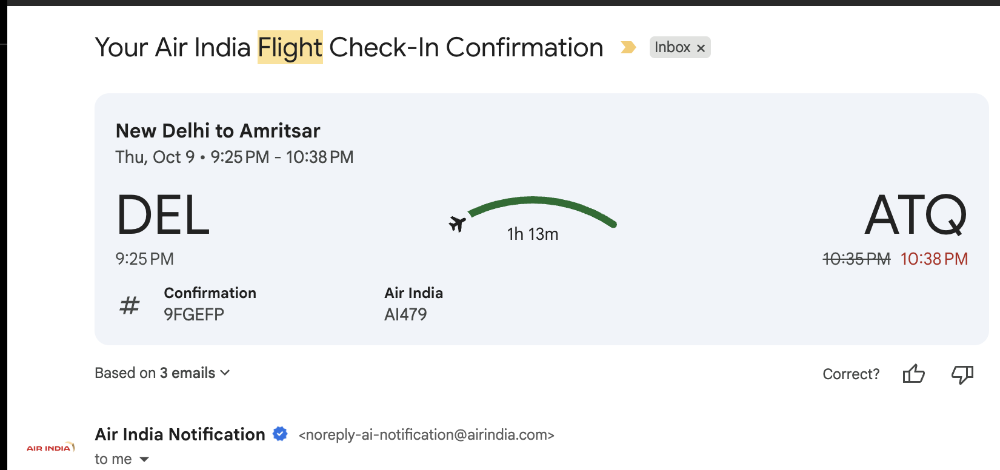
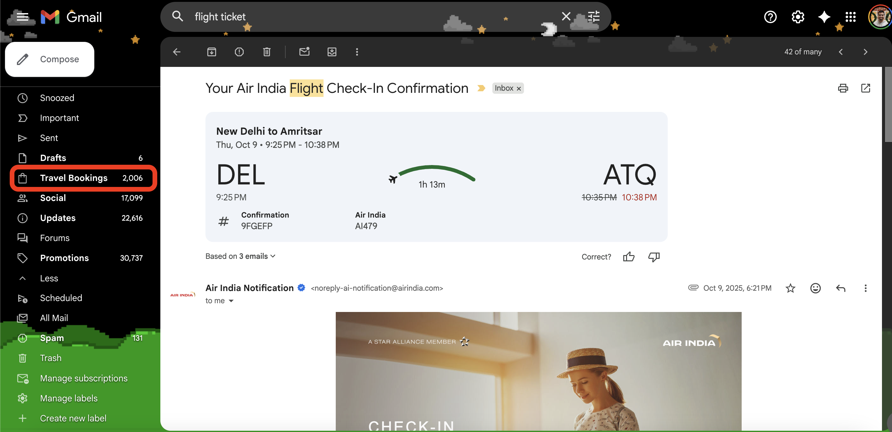

Just a few days back, I was trying to take an offline download of all the flight and hotel bookings for an upcoming trip from gmail & I just realized the whole process wasn't as smooth as it could be.

**Disclaimer** - 
* I had booked flights for 3 legs of my journey (2 people starting their itinerary from Delhi & 5 from Amritsar) - A total of 6 flight bookings & 4 hotel bookings
* Value seeking person that I am - I had heavily used Skyscanner in the booking process to seek discounts. All in all I ended up using 5 providers for making bookings

**On to the problem. What was I doing?**

Search Gmail -> SRP -> Eyeball the results -> Click on booking email -> Open Email -> Download attachment -> move to a drive folder

* Majority of the times, this worked. Whatever you're looking for shows up on the SRP in the first fold, you see an attachment and a PNR on an email, you know this is the one you're looking for
* Many a times, results aren't as relevant. What results made SRP irrelevant for my use case? These emails by OTAs 👇
    * How was your booking experience?
    * Book Forex for your upcoming trip
    * Secure your upcoming trip. Buy Travel Insurance
    * Book a Return Ticket
    * Book your stay with us

Now, gmail is already pretty good at 
* Identifying flight & hotel booking events from your mail. It does so by scanning your mail & attachmnents for [structured schema](https://developers.google.com/workspace/gmail/markup/reference/flight-reservation)
* It identifies entities (passenger name, pnr, departure city, departure airport etc.) from the email & adds a corresponding event to your calendars
* At times, on the day of the event, it'll read your calender - check your event location and current location & notify you to leave for your destination (with an ETA powered by Google Maps) 🤯

Wouldn't it be great if there's a pre-determined home for all such bookings/events/reservation emails inside gmail? 
Well, it could be for people who rely heavily on gmail to find and organize their events. So how would you do it?

Since, gmail already has a superb ability to parse emails to tell a event/booking email from a normal email. A dedicated collection in the right menu could just do the job. 

If there's a dedicated collection of "booking" emails - existing advanced search features can be extended here on this folder. Due to this folder's qualifying rule, marketing/promotion/targeting emails won't show up when searches are done on this folder.

***Metrics/Data I'd look at if I were the PM who made this:***
* CTR on the Booking folder
* \# of Email opened/re-opened from booking folder
* Search funnel inside Booking folder

***Maybe why it hasn't already been done:***
* Not all online agents use structured schema for Email Updates, 
* thus making it hard to confidently qualify a mail as a Booking email
* So, the True Positive rate (classifying right email under _Travel Booking_ folder) might be low
* Low True Positive rate (not having all my booking emails under this folder) might just be a poor UX to a power user like me
