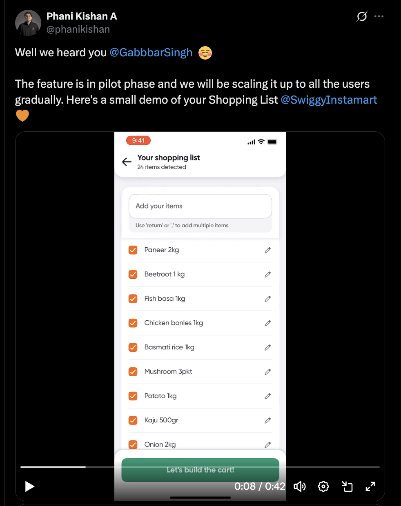
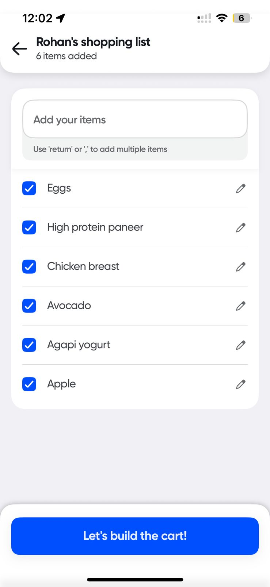
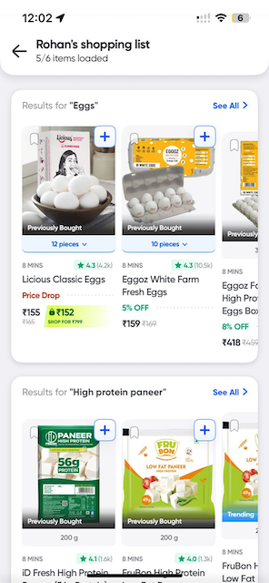

I remember reading an X thread almost a year back about Instamart launching **Shopping lists** feature in beta.

I hate ordering groceries as much as the next person & I had never noticed this feature on Swiggy. 
Not until today. So, naturally I tried using it.

**Some background on how I order:**
* I avg. around 25-30 Instamart orders a month (about 15 greater than Rs 500 AOV) & I don't use any other quick-commerce platform (because of the Swiggy HDFC 10% cashback)
* Most (if not all) of my AOV gte Rs 500 orders include repeated SKUs (Yogurt, Paneer, Eggs, veggies, fruits, etc.)
* I also don't switch brands often. I'm not a bargain hunter, I've come to like some brands & even Swiggy shows those as "Previously Bought" & those are the ones I end up ordering.

So, I'm pretty much a Instamart power user. Shopping Lists could be a super time saving feature for me. ***But it missed quite a few beats. Let's deep dive into it 👇***
1. So, you can create a shopping list by typing, scanning or reading out a list (this part is actually pretty neat)
    * You create a list 
    * Each of the items in your list ends up getting it's own search & you get a combined SRP for your whole shopping list
    * Then you add items in your cart from this combined SRP

2. But once you create a shopping list, and use it, **it's not saved for future**. You just can't save it 🤯
    * Do you always want me type, scan or read out a list? 🤔
3. Ideally, the AHA moment could've been if there were a **pre-created shopping list** waiting for me to order from (based on my order history which Instamart has plenty of)
    * Send me a notification ***"Rohan, ready to order the usuals?"*** ➡️ land me on this pre-created shopping list 🫨

4. On to the SRP. Pretty neat UX but **none of the SKUs are already added in my cart**. I have to pick and choose the SKUs again and add them to my cart. 
    * Why not automatically add a minimum quantity of a previously ordered SKU to the cart 
    * I can later change quantity, switch a brand OR remove an item altogether if my preferred brand is out of stock or I just don't like the price of bananas today.
    * Easy opportunity to save the user another ~2 mins

<!--
If I were to priortize among these 3 t

|Feature|Prirority|Comments|
|---|---|---|
|Saved Shopping List|High|
|Generate personalized shopping lists|Medium|
|Cart building|Medium|
--->

Now I understand if users order more using Shopping lists, their avg. **Time To Order also reduces**, thus users:
* Spend lesser time viewing ads
* Discover lesser sponsored products
* Discover lesser new product categories from home page, SRP

**If I was the PM who worked on this, I'd have looked at**
1. How do retention metrics (6 month, 9 month, 12 month retention numbers) for Shopping List users compare to non users? 
2. How is the Order Frequency & AOV trending for Shopping list users?

If you were Instmart CEO, would you want more people to order using Shopping Lists?

