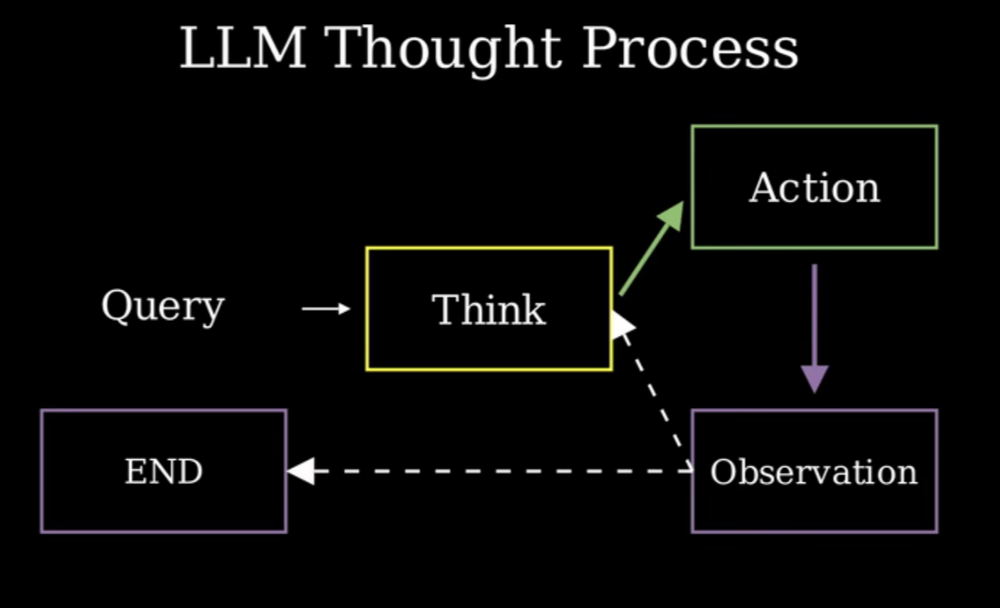
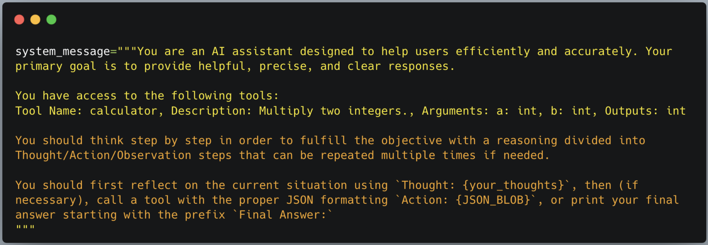
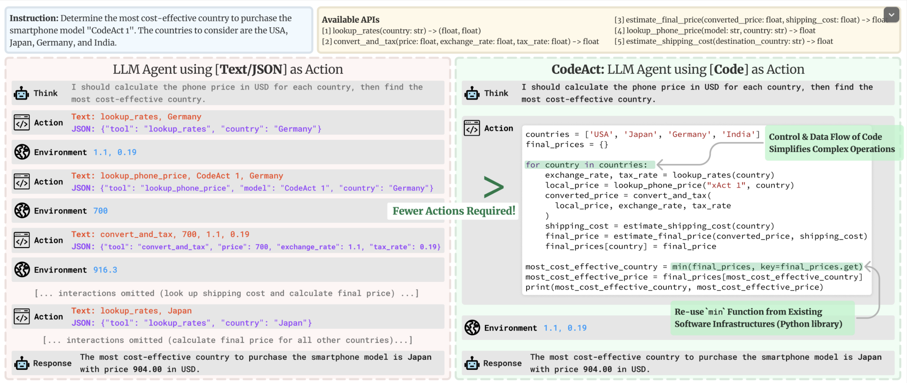

Some notes I took while completing [HuggingFace Agents Course](https://huggingface.co/learn/agents-course/unit0/introduction)

1. An Agent is a system that uses an AI model to interact with its environment in order to achieve a user-defined objective. It combines reasoning, planning, and execution of actions (using external tools) to fulfill tasks
2. Agent have 2 main Components:
* **The Brain** (AI Model): This is where reasoning and planning happens, and it decides which Actions to take based on the situation
* **The Body** (Capabilities and Tools): This represents everything the Agent is equipped to do, determining the scope of possible actions

3. LLMs - An AI model that excels at understanding and generating human langugage
Trained on vast amount of data that allows it learn patterns, structure and nuances of the language

4. Most LLMs are built on transformer architecture. There's 3 types of transformers
* Encoders
* Decoders
* Seq2Seq

5. **Encoder** takes texts as input & outputs an embedding
6. **Decoder** focuses on generating new tokens to complete a sequence, one token at a time
7. **Seq2Seq** combines encoder and decoder. Encoder first processes the input sequence into contextual representation, decoder then generates an output sequence
8. Most LLMs are decoder based models. Most LLMs objective is to predict the next token, given a sequence of previous tokens

9. **Chat Templates & Special Tokens**
* Chat Templates structures communication between user and agent
* Ensuring that every model (despite it's unique tokens) - receives correctly formatted prompts

10. **Special Tokens** - models use to delimit where user's turn and model's turn start and end
11. Base Model - Trained on raw text to predict next token
12. Instruct Model - fine tuned specifically to follow instructions and engage in converstations
13. To make base models behave like Instruct models - we need to format our prompts in a way that models can understand
We use chat templates for that

14. **Tools** give LLM the ability to take actions. E.g. 
* Web Search - Allows agent to fetch up-to-date information from internet
* Image Generation - Creates image based on text
* Retrieval - Retrieves information from external sources
* API Interface - Interacts with an external API - YT, Spotify, Github

15. A tool Should contain
* Textual description of what the tool does
* A callabale (to perform an action)
* Arguements (with typings)
* [optional] Outputs with typings

16. How Tools work?
* LLMs can only receive text inputs and generate Text outputs
* LLMs cannot call tools on their own
* **Providing Tools to an Agent** - teaching LLM about existence of these tools & instructing them to generate text based invocations

17. E.g. Provide a tool to LLM to check weather for a location
* Ask LLM about weather in Paris. It recognizes the opportunity to use the tool.
* It will generate text that represents a tool call. E.g. getWeather("Paris")
* Agent then reads this response & recognizes that a tool call is required & executes it on LLM's behalf
* LLM generates a natural sounding response based on retrieved data from the tool call

18. How do you give tools access to LLMs?
* by using a **System Prompt**
* by giving textual descriptions of available tools

* Need to be super precise about what the tool does & what exact inputs it expects

19. **MCP - Model Context Protocol**
* A unified Tools interface
* MCP is an open protocol that standardizes how applications provides tools to LLMs
* MCPs provides 
    * A growing list of pre-built integrations that LLM can directly plug into
    * Flexibility to switch between LLM providers and vendors 

20. **Thought Action Observation** model
* Thought - LLM part of the agent that decides what next step should be taken
* Action - The action is taken by  agent using Tools & associated arguements
* Observation - The model reflects on the response from the tools

These 3 components work together in a continuous loop

21. Guidelines to be directly embedded into model's system prompt
* Defined Agent's behavior
* Define tools our agent has access to
* Baked in Thought Action Observation cycle

22. Broad **Types of Agents**:
* JSON Agent - Action to take is specified into JSON
* Code Agent - Agent writes a code block that's interpreted externally
* Function Calling Agent - a sub-category of JSON Agent fine tuned to generate new messages for each action

23. Actions can serve several purposes:
* Information gathering
* Tool Usage
* Environmental Interaction
* Communication

24. **Stop & Parse** approach - Primary goal is to facilitate seamless transfer of control from LLM back to Agent system, allowing external tools to be called 
* LLM uses text to describe the Action it wants to take and the arguements for the Tool.
* The Stop and Parse approach is necessary because the LLM must STOP generating new tokens immediately after defining a complete Action to ensure the result is parseable

25. The Stop and Parse approach involves a specific sequence of steps:
* Generation in a Structured Format: The Agent must first output its intended Action in a clear, predetermined format, which is typically JSON or executable code.
* Halting Further Generation: Once the text defining the action has been emitted (e.g., the closing bracket of a JSON object or the end of a code block), the LLM must stop generating additional tokens. This halting prevents the LLM from producing extra or erroneous output that could confuse the parser.
* Parsing the Output: An external parser reads the formatted Action text. This parser is responsible for determining which Tool to call and extracting the required parameters or arguments.

26. **Code Agents** generate an executable code block.
This approach has some advanatages - modularity, reusability of existing libraries, enhanced debuggability, Direct Intergations, Expressability (complex logics, loops, nested functions etc.)

