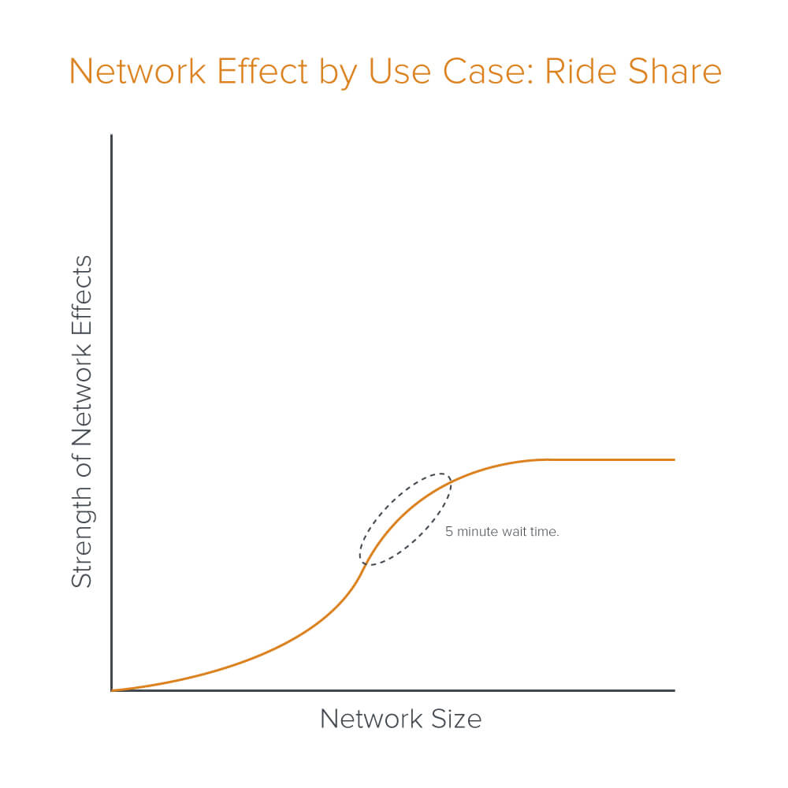
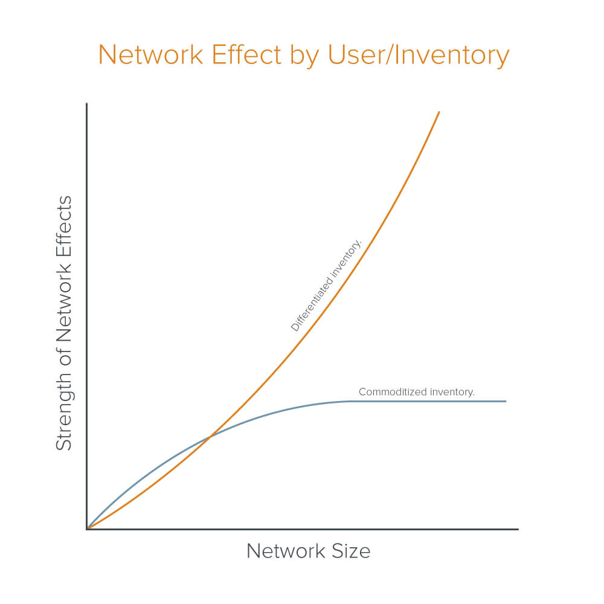

## What Are Network Effects?

Network effects happen when a product, service, or platform's value increases as more people use it.
This is especially true for products and platforms where user numbers influence value.
Examples of network effects appear in payments (UPI), e-commerce (Amazon, Flipkart), ridesharing (Rapido, Uber), delivery platforms (Swiggy, zomato, Zepto), and social media (Facebook, Twitter, Instagram, LinkedIn).

## Types of Network Effects

1. **Direct (Same Side network effect):** Platform value grows directly as more users join. Examples include social networks like Reddit, Instagram, and LinkedIn.
2. **Indirect (Cross-Side network effect):** Value increases for one user group as another group grows. For example, more sellers attract more buyers in e-commerce.

## When Network Effects Change

In order to forecast how a business can evolve along it's network effect, it's important to understand: 
1. Your Value Proposition
2. Your Users OR Your Inventory
3. Competitive Ecosystem

### Value Proposition
* Not all network effects are equally strong and durable. A product's value may peak & the network effect plateaus due to that.

* Initially, more riders in a city attract more drivers to join the platform, as they expect to get fares more quickly.
* More drivers on the road mean lower wait times, better availability and stable pricing for riders.
* Once you (and other platforms) hit a decent wait-time/pricing combo, riders are indifferent to whether there are more drivers available on your network. Your specific platform matters less to riders now. Your network effect plateaus.

### Users and Inventory
* The type and quality of users matter (not all users are equal)
* Supply quality matters even more.

* Platforms with **differentiated inventory**, like sellers on Amazon, hotels on MakeMyTrip, restaurants on Swiggy typically sustain strong network effects longer.
* Platforms with **commoditized supply**, like rideshare drivers (uber, rapido, ola) do not. 
* Some users/inventory may add value (getting Virat Kohli or Modiji to tweet on X), subtract value (hotel listed on MakeMyTrip not providing listed amenities), or have no/neutral value (new user on Facebook)

### Competitive Ecosystem
* Platforms can face risks even with strong network effects 
* Competitors often have **overlapping networks** (Swiggy & Zomato)
* Users face **low switching costs**. 
* Users also **"multi-tenant"**. For example, driver lists on multiple ridesharing apps (Rapido & Uber). 
* These pressures soften network moats.

Notes from [a16z blog](https://a16z.com/the-dynamics-of-network-effects/)

